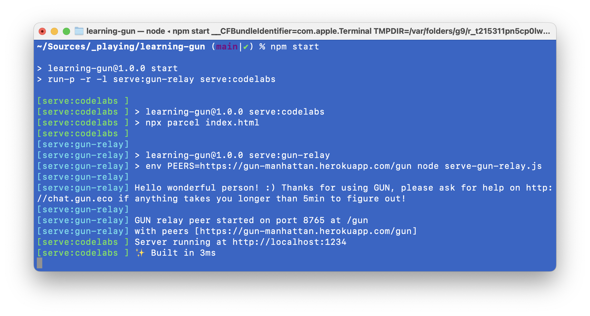

# Learning the GUN.eco database

Learning to use the [GUN](https://gun.eco) database and ecosystem – articles, useful resources, courseware, personal notes.

## Learning / Codelabs

1. [Public pastebin](codelabs/1-pastebin/)
2. [To-do dapp](codelabs/2-todo-dapp/)

## Usage

Execute `npm start` on the command-line and open [`http://localhost:1234/`](http://localhost:1234/) in your browser.

