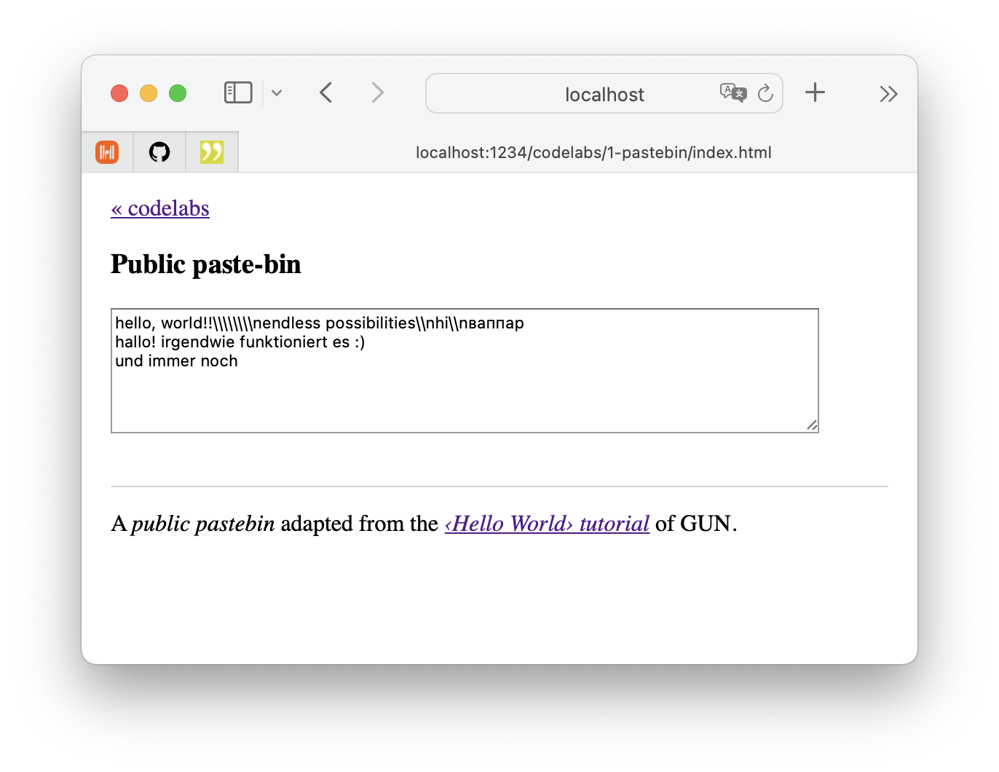

# Codelabs › Public pastebin

A _public pastebin_ adapted from the [‹Hello World› tutorial](https://gun.eco/docs/Hello-World) of GUN.eco for vanilla DOM & JS.

## Usage

Execute `npm start` on the command-line and open [`http://localhost:1234/codelabs/1-pastebin/`](http://localhost:1234/codelabs/1-pastebin/) in your browser.

