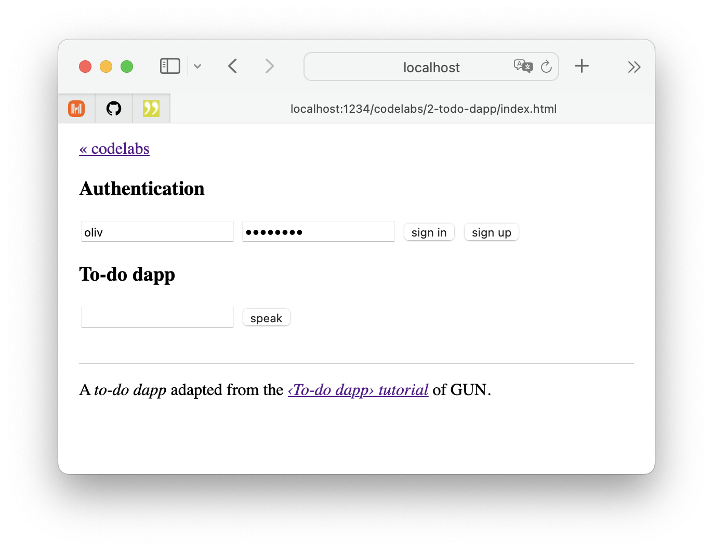
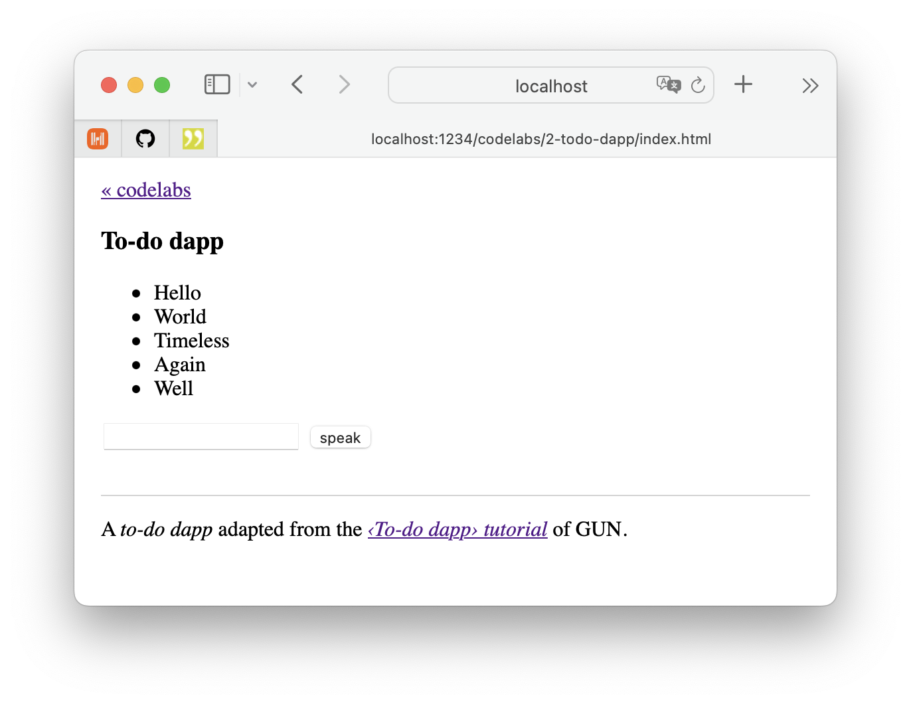
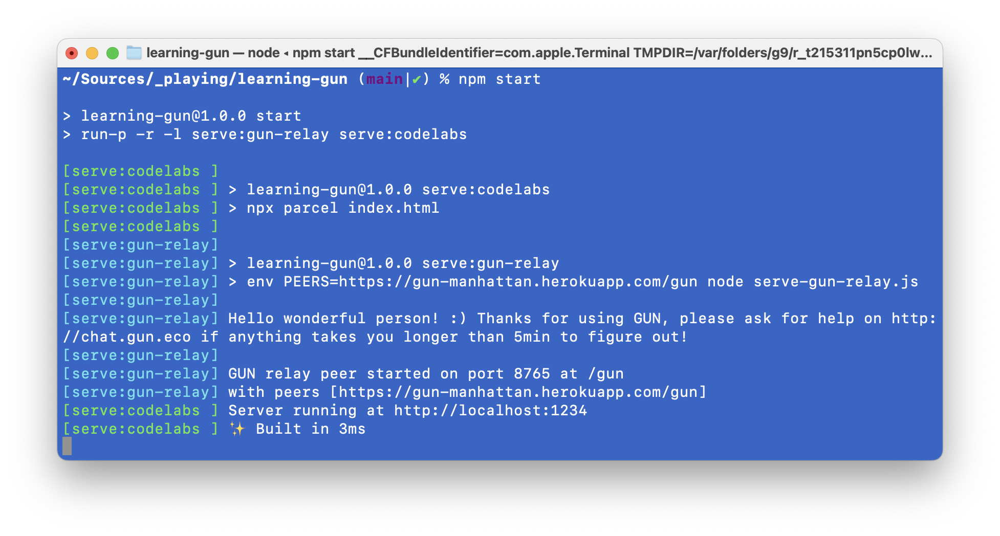

# Codelabs › To-do dapp

A _to-do dapp_ adapted from the [To-do dapp tutorial](https://gun.eco/docs/Todo-Dapp) of GUN.eco for vanilla DOM & JS.

## Usage

Execute `npm start` on the command-line and open [`http://localhost:1234/codelabs/2-todo-dapp/`](http://localhost:1234/codelabs/2-todo-dapp/) in your browser.

