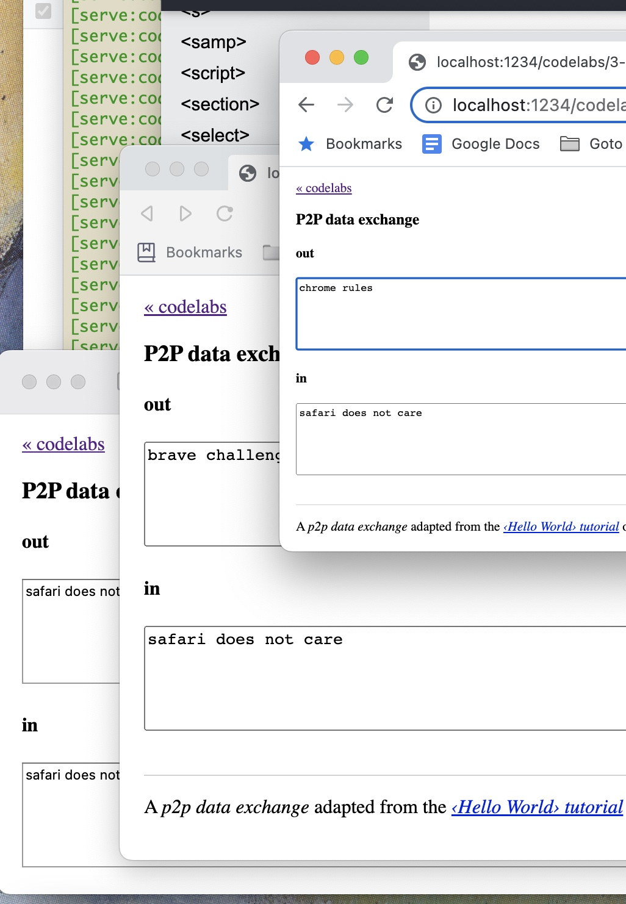

# Codelabs › Try data exchange between peers

A _data exchange experiment_ adapted from the [‹Hello World› tutorial](https://gun.eco/docs/Hello-World) of GUN.eco for vanilla DOM & JS.

## Usage

Execute `npm start` on the command-line and open [`http://localhost:1234/codelabs/3-p2p-data-xchg/`](http://localhost:1234/codelabs/3-p2p-data-xchg/) in several browsers or tabs.

Data which you type in the _out_ box will be replicated to participants' _in_ boxes, replacing the previous data there.

Such data are meant to emulate the game state data that would be exchanged between participants in a shared game.

